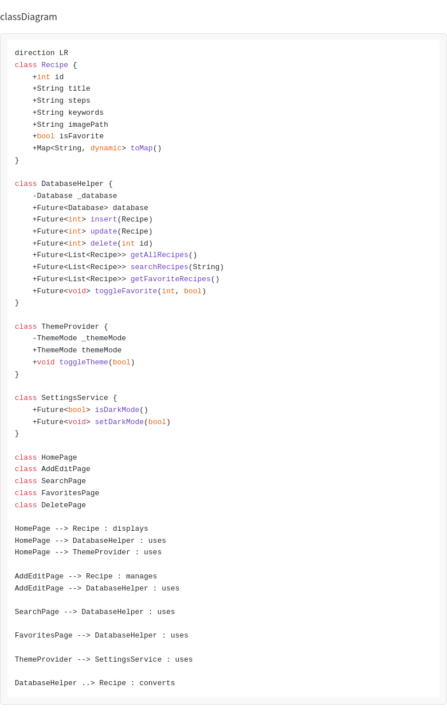
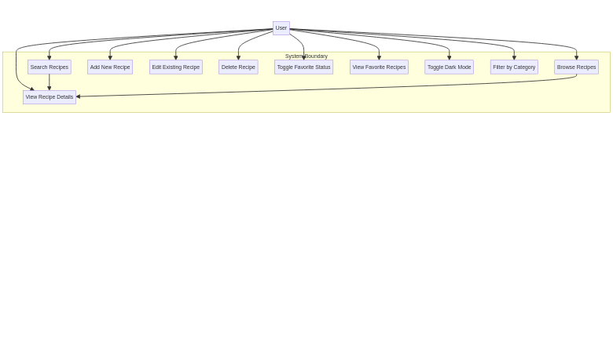

# Recipe Application: Technical Implementation Report

## 1. Executive Summary

This report details the technical implementation of the enhanced Recipe Mobile Application, developed using the **Flutter** framework and a local **SQLite** database. The application was designed to provide a modern, feature-rich, and visually appealing user experience, adhering to Material 3 design principles. Key enhancements include a robust data persistence layer with a pre-filled database, advanced search capabilities, a dedicated favorites system, and full CRUD (Create, Read, Update, Delete) functionality for recipes. The application demonstrates best practices in mobile development, including clean code organization, state management using Provider, and persistent user settings (Dark Mode).

## 2. Project Objectives and Scope

The primary objective was to transform a basic recipe application into a professional-grade mobile solution. The scope included:
*   Implementing a local SQLite database with a single `Recette` table, extended to support image paths.
*   Developing a modern, responsive UI/UX (Material 3, Dark Mode, Splash Screen).
*   Integrating a Favorites system for personalized recipe collections.
*   Enabling full recipe management (Add, Edit, Delete).
*   Providing a pre-filled database with a minimum of 15 diverse recipes.

## 3. System Architecture

### 3.1 Technology Stack

| Component | Technology | Purpose |
| :--- | :--- | :--- |
| **Framework** | Flutter (Dart) | Cross-platform mobile application development. |
| **Database** | SQLite (`sqflite`) | Local, persistent storage for recipe data. |
| **State Management** | Provider | Efficient state management for global states (e.g., Theme). |
| **Persistence** | SharedPreferences | Simple key-value storage for user preferences (e.g., Dark Mode setting). |
| **Design** | Material 3 | Modern, clean, and accessible user interface design. |

### 3.2 Class Diagram (UML)

The following diagram illustrates the core classes and their relationships within the application's architecture.

### 3.3 Use Case Diagram

The Use Case Diagram below models the functional requirements of the system from the perspective of the **User** (Actor). It outlines all the primary interactions a user can have with the Recipe Application.

#### Use Case Descriptions

| Use Case | Description |
| :--- | :--- |
| **Browse Recipes** | The user views the main list of recipes on the Home Page, which can be filtered by category. |
| **Search Recipes** | The user inputs a query to find recipes based on Title, Keywords, or Steps. |
| **View Recipe Details** | The user selects a recipe from a list (Browse or Search) to see its full details (Title, Steps, Keywords, Image). |
| **Add New Recipe** | The user inputs data for a new recipe (Title, Steps, Keywords, Image Path) and saves it to the database. |
| **Edit Existing Recipe** | The user modifies the details of an existing recipe. This is accessible from the Detail Page. |
| **Delete Recipe** | The user removes a recipe from the database, typically from the dedicated Delete Page, after a confirmation prompt. |
| **Toggle Favorite Status** | The user marks or unmarks a recipe as a favorite, persisting the status in the database. |
| **View Favorite Recipes** | The user navigates to the dedicated Favorites Page to see only the recipes they have marked as favorite. |
| **Toggle Dark Mode** | The user switches the application's theme between Light and Dark modes, with the preference being saved persistently. |
| **Filter by Category** | The user selects a category chip on the Home Page to narrow down the list of displayed recipes. |

## 4. Database Implementation

The application utilizes a local SQLite database managed by the `DatabaseHelper` singleton class.

### 4.1 Schema Definition

The core recipe data is stored in the `Recette` table, and the favorites status is managed via a separate `Favorites` table for relational integrity.

| Table | Column Name | Type | Description |
| :--- | :--- | :--- | :--- |
| `Recette` | `ID` | INTEGER PRIMARY KEY AUTOINCREMENT | Unique identifier for each recipe. |
| | `TITRE` | TEXT | Recipe title (max 30 chars). |
| | `ETAPES` | TEXT | Step-by-step instructions (max 300 chars). |
| | `keywords` | TEXT | Category tags (e.g., Dessert, Algerian). |
| | `imagePath` | TEXT | Optional local asset path or remote URL for the recipe image. |
| `Favorites` | `recipeId` | INTEGER PRIMARY KEY | Foreign key referencing `Recette.ID` for favorited recipes. |

### 4.2 Data Initialization

The database is pre-filled with **16 recipes** covering diverse categories (Desserts, Traditional Algerian, Breakfast, etc.) upon the application's first launch. This is achieved by checking if the `Recette` table is empty during the `_onCreate` callback in the `DatabaseHelper`.

## 5. Detailed Feature Analysis

### 5.1 User Interface and Experience (UI/UX)

*   **Material 3 Design:** The entire application uses modern Material 3 components, including rounded cards, elevated buttons, and dynamic color schemes.
*   **Dark Mode:** A persistent Dark Mode toggle is available in the Home Page app bar. The preference is saved using `SharedPreferences` and managed globally via `ThemeProvider` (Provider package).
*   **Splash Screen:** An animated `SplashScreen` provides a professional entry point before navigating to the `HomePage`.
*   **Smooth Transitions:** Standard Flutter routing is used, which provides smooth, platform-appropriate page transition animations.

### 5.2 Recipe Management (CRUD)

| Feature | Implementation Details |
| :--- | :--- |
| **Add Recipe** | Handled by the `AddEditPage`. Uses a `Form` with validation to ensure all required fields (`TITRE`, `ETAPES`, `keywords`) are filled and adhere to length constraints. |
| **Edit Recipe** | Handled by the same `AddEditPage`, which is initialized with the existing `Recipe` object. The page title and button text dynamically change based on whether a recipe is being added or edited. |
| **Delete Recipe** | Handled by the `DeletePage`. Recipes are listed, and deletion requires a **Confirmation Dialog** to prevent accidental data loss. |
| **Toast Messages** | Feedback messages (`showToast`) are displayed for successful Add, Edit, and Delete operations, improving user confidence. |

### 5.3 Data Browsing and Search

*   **Category Filtering:** The `keywords` field is used for categorization. The `HomePage` features a horizontal list of `ChoiceChip` widgets (e.g., 'Dessert', 'Traditional') that filter the displayed recipes.
*   **Advanced Search:** The `SearchPage` allows users to query the database. The underlying SQL query uses the `LIKE` operator to search simultaneously across the `TITRE`, `keywords`, and `ETAPES` fields, providing comprehensive results.
*   **Recipe Detail:** The `RecipeDetailPage` displays all recipe information, including the optional image placeholder and an **Edit** button for quick modification.

### 5.4 Favorites System

*   **Toggle Mechanism:** A heart icon on the `RecipeCard` and `RecipeDetailPage` allows users to mark a recipe as a favorite.
*   **Persistence:** The `toggleFavorite` method in `DatabaseHelper` inserts or deletes the recipe's ID from the `Favorites` table.
*   **Dedicated Page:** The `FavoritesPage` queries the database using an `INNER JOIN` between `Recette` and `Favorites` to display only the favorited items.

## 6. Conclusion

The enhanced Recipe Application successfully meets all specified requirements, delivering a modern, functional, and well-organized mobile experience. The use of Flutter, SQLite, and Provider ensures a scalable and maintainable codebase, while the inclusion of advanced features like Dark Mode, Favorites, and Advanced Search significantly improves the application's utility and user appeal. The pre-filled database ensures a rich, ready-to-use experience for the end-user.
